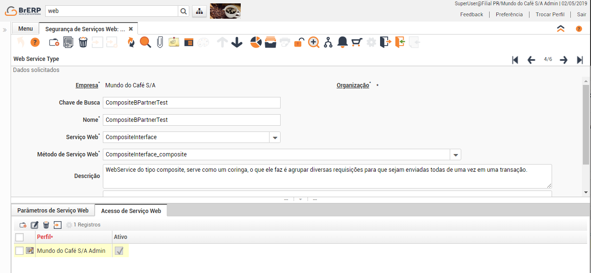

# BrERP Web Service Connector - Pascal


Com o BrERP Web Service Connector, as requisições para os webservices do BrERP que utiliza SOAP se tornam mais simples a partir de sua aplicação **Delphi**. Podendo utilizar a arquitetura "Model Oriented" ou "Composite" (que é a junção de uma ou mais requisições Model) torna desnecessário o tratamento dos arquivos XML. 

Exemplos do que podem ser feito com uma requisição: 

* CRUDs, em qualquer tabela do sistema; 
* Extrair informações de views; 
* Executar Doc Actions em qualquer documento do BrERP;  
* Executar processos. 

## Compatibilidade
---
A biblioteca BrERPwscPascal foi criada atraves do RAD Studio 10.3 Rio, mas o requerimento minimo para a lib são os pacotes:
 * Soap.InvokeRegistry
 * Soap.SOAPHTTPClient
 * Soap.XSBuiltIns
 * System.SysUtils
 * System.Types

## Repositório
---
O repositório é composto pelas pastas:
 * ***DelphiExamples***
   * Contém um projeto em Delphi com os **exemplos de requisições** basicas:
     * Criar um Parceiro de Negócios
     * Consultar um Parceiro de Negócios utilizando o campo "Chave de Busca"
     * Criar uma Imagem do Sistema
     * Retornar uma Imagem do Sistema
     * Criar uma Imagem e um Parceiro e vincular a Imagem à Logo do Parceiro
 * **documents**
   * Contem todos os XML utilizados pelo projeto exemplo, tanto a **Requisição como a Resposta**.
 * **lib**
   * Contém a biblioteca **BrWRPescPascal.pas** que será adicionada ao seu projeto, também é o código fonte.

## Instalação
---
A instalação da biblioteca é simples, basta fazer o Download do Arquivo **BrERPwscPascal.pas** dentro da pasta **lib**:


Mover o arquivo para a pasta do seu projeto e Adicionar:


**Lembre-se de Adicionar a biblioteca nas suas "Uses"**


## Exemplo Prático - Criando um Parceiro de Negócios com Imagem de Logo
---
Antes de fazer qualquer requisição, é necessário criar uma configuração basíca do **BrERP**, para isso acesse a janela "**Segurança de Serviços Web**". Neste exemplo usaremos dois tipos de requisição:
 * Model Oriented Web Services:
   * Criar Parceiro
   * Criar Imagem
 * CompositeInterface

Vamos iniciar pelas requisições de Modelo:


 1. Escolha um Nome e uma Chave de Busca que facilite a sua busca pela Requisição.
 1. O Tipo do Serviço, no caso usaremos o **Model Oriented Web Services**
 1. Dentre todos os processos existente, usatemos nesse exemplo o **Model Oriented Web Services_Create Data**, pois criaremos um Parceiro de Negocios.
 1. Tabela usada na Requisição que no nosso exemplo será a **C_BPartner**
 1. Aqui serão adicionados os campos que a requisição aceitará, especificamente precisaremos dos campos:
     * Name_Nome 
     * Value_Chave de Busca 
     * TaxID_ID de Imposto 
     * Logo_ID_Logo 
 1. (Opcional) Adicione também campos para retorno da sua Requisição.
 1. Escolha quais perfis terão acesso a requisição.

Faremos o mesmo para as Imagens


Após isso, necessitamos configurar a requisição do tipo Composite, que nada mais nada menos, é responsável por agrupar varias requisições do tipo Model e envia-las todas de uma vez.



Após tudo configurado, prepare seu projeto. Nesse exemplo, usaremos o Projeto em Delphi disponibilizado no Repositório. Para isso, clone o repositório em sua maquina, ou faça download manualmente

``` bash
git clone https://github.com/devcoffee/brerpwsc-pascal
```

Abra o projeto e execute.

Código exemplo explicado:

``` Delphi
uses
  BrERPwscPascal;
//=== Composite Test ===========================================================
procedure TClient.btnCompositeClick(Sender: TObject);
var // Variaveis de envio
  arg1 : CompositeRequest;
  response : CompositeResponses;
  operations : BrERPwscPascal.operations;
  operation0, operation1 : operation;
  data0, data1, data2, data3 : DataField;
  dataRow : BrERPwscPascal.DataRow;
  // Variaveis de Retorno
  compositeResponse : BrERPwscPascal.CompositeResponse;
  standardResponse : StandardResponse2;
  output : outputFields;
  I, X, J : Integer;
begin
  // Valor aleatório, somente para evitar conflito com os já existentes no sistema
  EditCompositeValue.Text := IntToStr(random(1000000)+5000000);
  EditCompositeTax.Text   := EditCompositeValue.Text;

  arg1 := CompositeRequest.Create;
  // Adicionar credenciais de Acesso
  arg1.ADLoginRequest := ADLogin;

  // O nome do Serviço usado, no caso CompositeBPartnerTest
  arg1.serviceType := 'CompositeBPartnerTest';

  SetLength(dataRow,3);
  // Informações da primeira requisição (CreateImageTest)
  data0        := DataField.Create;
  data0.column := 'Name';
  data0.val    := EditCompositeName.Text+'_Logo';
  DataRow[0]   := data0;

  data1        := DataField.Create;
  data1.column := 'Description';
  data1.val    := EditCompositeValue.Text+'_Desc';
  DataRow[1]   := data1;

  data2        := DataField.Create;
  data2.column := 'BinaryData';
  data2.val    := Base64FromPicture(ImageCreateImage.Picture);
  DataRow[2]   := data2;

  // Criar a primeira operação
  operation0 := Operation.Create;
  operation0.TargetPort := TargetPort.createData; // TargetPort é o tipo configurado em Método de Serviço Web
  operation0.ModelCRUD := ModelCRUD.Create;
  operation0.ModelCRUD.DataRow := dataRow; // Adicionar os dados
  operation0.ModelCRUD.serviceType := 'CreateImageTest'; // Nome da operação Model

  SetLength(dataRow,0);
  SetLength(dataRow,4);
  // Informações da Segunda Requisição (CreateBPartnerTest)
    data0        := DataField.Create;
    data0.column := 'Name';
    data0.val    := EditCompositeName.Text;
    DataRow[0]   := data0;

    data1        := DataField.Create;
    data1.column := 'Value';
    data1.val    := EditCompositeValue.Text;
    DataRow[1]   := data1;

    data2        := DataField.Create;
    data2.column := 'TaxID';
    data2.val    := EditCompositeTax.Text;
    DataRow[2]   := data2;

    data3        := DataField.Create;
    data3.column := 'Logo_ID';
    data3.val    := '@AD_Image.AD_Image_ID';
    DataRow[3]   := data3;

    // Create Second Operation
    operation1 := Operation.Create;
    operation1.TargetPort := TargetPort.createData; // TargetPort é o tipo configurado em Método de Serviço Web
    operation1.ModelCRUD := ModelCRUD.Create;
    operation1.modelCRUD.DataRow := dataRow; // Adicionar os dados
    operation1.modelCRUD.serviceType := 'CreateBPartnerTest'; // Nome da operação Model
  
  // Adicionar Operações a Requisição
  SetLength(operations,2);
  operations[0] := operation0;
  operations[0].preCommit := false;
  operations[0].postCommit := false;

  operations[1] := operation1;
  operations[1].preCommit := false;
  operations[1].postCommit := false;

  arg1.operations := operations;


  { Metodo GetCompositeRequest, responsável por realizar a requisição.
    O metodo pode ser chamado de duas maneiras:
      * Sem parametros
        GetCompositeService().compositeOperation
            Desta forma o metodo utilizará a URL padrão: 'http://teste.brerp.com.br'

      * Com argumentos
        GetCompositeService(UseWSDL, URL, HTTPRio).compositeOperation
            Pode-se assim escolher a URL da requisição e até mesmo obter o XML, utilizando os parametros HTTPRIO1BeforeExecute e HTTPRIO1AfterExecute do HTTPRio fornecido.
  }
  response := GetCompositeService(true, EditURL.Text, HTTPRIO1).compositeOperation(arg1);

  // Pegando o retorno e adicionando a um TMemo
  MemoComposite.Clear;
  for X := Low(response) to High(response) do begin
    compositeResponse := response[X];
    for J := Low(compositeResponse) to High(compositeResponse) do begin
      standardResponse := compositeResponse[J];
      if (standardResponse.IsError) then
        MemoComposite.Lines.Add('Error: ' + standardResponse.Error)
      else
        for I := Low(standardResponse.outputFields) to High(standardResponse.outputFields) do begin
          output := standardResponse.outputFields[I];
          MemoComposite.Lines.Add('Column: ' + output[I].column);
          MemoComposite.Lines.Add('Value: '  + output[I].value );
          MemoComposite.Lines.Add('Text: '   + output[I].Text  );
          MemoComposite.Lines.Add('---------------------------');
        end;
    end;
  end;
end;
```

Com o Exemplo rodando, acesse o menu e configure a base de acesso


Após isso, acesse a aba **Composite BP** e clique em "Send Request":


## Resultado da Requisição:
---


## Requisições Simples
---
Para realizar uma requisição simples, poucas auterações no código são necessárias, como por exemplo, as requisições não precisam ser separadas por operação:

``` Delphi
uses
  BrERPwscPascal;
//=== Query BPartner Test ======================================================
procedure TClient.btnQueryBPClick(Sender: TObject);
var
  response : WindowTabData;
  dataRow : BrERPwscPascal.DataRow;
  data0 : DataField;
  I, X: Integer;
begin  
  arg0 := ModelCRUDRequest.Create;
  // Adicionar credenciais de Acesso
  arg0.ADLoginRequest := ADLogin;

  // Configurações do CRUD
  arg0.ModelCRUD.serviceType := 'QueryBPartnerTest'; // Tipo do serviço configurado em Método de Serviço Web
  
  SetLength(dataRow,1);
  // Dados a serem enviados
  data0        := DataField.Create;
  data0.column := 'Value'; // Nome do campo (Configurado em Segurança de Serviços Web)
  data0.val    := EditQueryBPQuery.Text; // Valor do Campo
  DataRow[0]   := data0;

  // Adicionar os dados a requisição
  arg0.ModelCRUD.DataRow := dataRow;

  { Requisição GetModelADService
      GetModelADService().Metodo - Sem Parametros URL: 'http://teste.brerp.com.br'
      GetModelADService(UseWSDL, URL, HTTPRio).Metodo

      Na Requisição simples existem varios tipos de serviços, nos quais você deve configurar de acordo com o tipo da requisição:

      Metodo            Paramatro                   Tipo do Retorno
      -----------------|---------------------------|-------------------
      createUpdateData  (ModelCRUDRequest)	        StandardResponse
      setDocAction      (ModelSetDocActionRequest)	StandardResponse
      createData        (ModelCRUDRequest)	        StandardResponse
      deleteData        (ModelCRUDRequest)	        StandardResponse
      readData          (ModelCRUDRequest)	        WindowTabData
      getList           (ModelGetListRequest)           WindowTabData
      runProcess        (ModelRunProcessRequest)	RunProcessResponse
      updateData        (ModelCRUDRequest)	        StandardResponse
      queryData         (ModelCRUDRequest)	        WindowTabData
  }
  response := GetModelADService(true, EditURL.Text, HTTPRIO1).queryData(arg0); 

  // Pega a resposta e adiciona em um TMemo
  MemoQueryBP.Clear;
  if(response.Success) then begin // Se foi um sucesso
    for X := Low(response.DataSet) to High(response.DataSet) do begin
      dataRow := response.DataSet[X];
      for I := Low(dataRow) to High(dataRow) do begin
        MemoQueryBP.Lines.Add(dataRow[I].column + ': ' + dataRow[I].val);
      end;                                                   
      MemoQueryBP.Lines.Add('----------------------------');
    end;
  end else begin // Se Falhou
    MemoQueryBP.Lines.Add('Error: '     + response.Error);
    MemoQueryBP.Lines.Add('ErrorInfo: ' + response.ErrorInfo);
  end;
end;
```